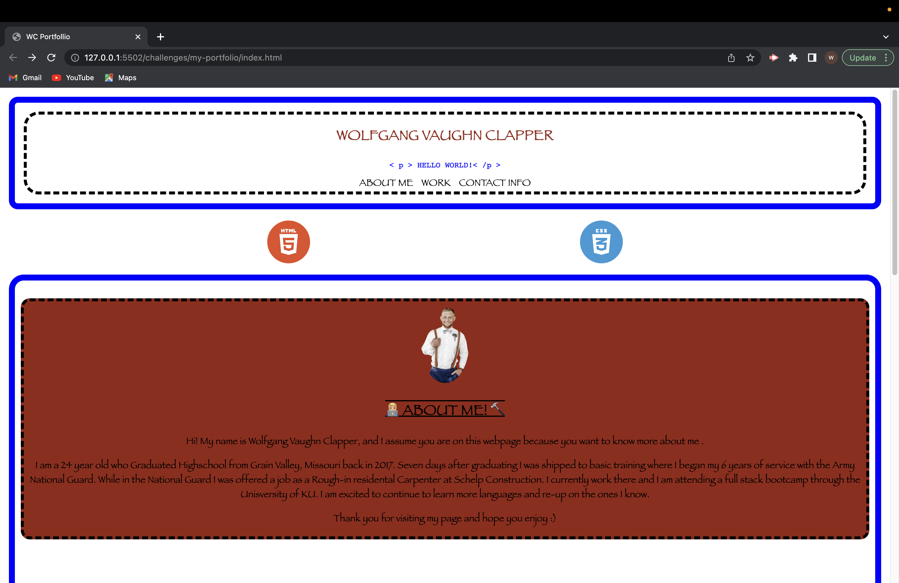
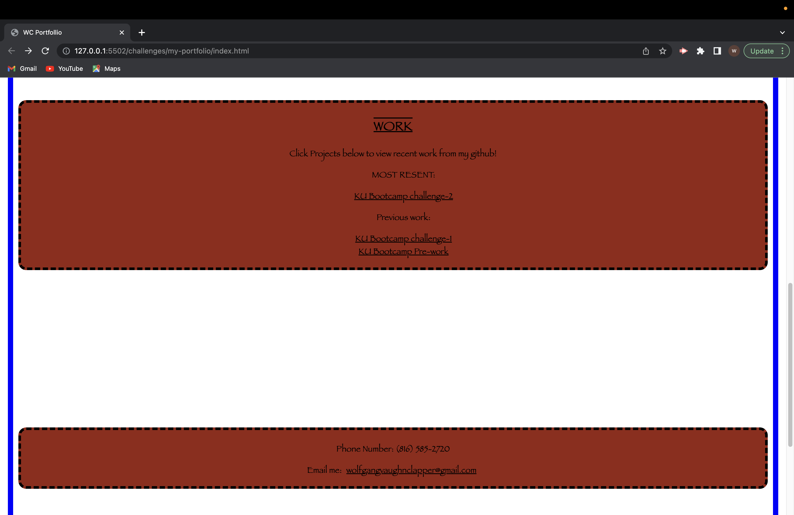

# challenge-2 My Portfolio!

## Description

This project I created a my first Portfolio! I was able to use what I learned inside of class along with the sources I listed below to create my webpage portfolio. While building this I had the biggest motivator knowing I could end up using this one day.

## Installation
N/A

## Usage

When viewing the portfolio you will first see my name along with a couple quick ui buttons to scroll straigh to the sections. When you visit the "work" section you will be able to view my links to resent work. Also if you scroll or click the "contact info" at the top of the page it will take you to my phone number and a way to email me. Lastly on this webpage portfolio if you view the webpage on a small screen then view on a larger screen you will seen they are colored a little different.
 

 

 

## Credits
 I grabbed the "ℹ️" logo for challenge-2  https://developer.mozilla.org/en-US/docs/Web/HTML/Global_attributes/id 

I used "W3 Schools" website for a lot of help with figuring out syntax. https://www.w3schools.com/

I used this youtube video to help me understand Media Queries. https://www.youtube.com/watch?v=2KL-z9A56SQ&t=133s

## License
N/A
